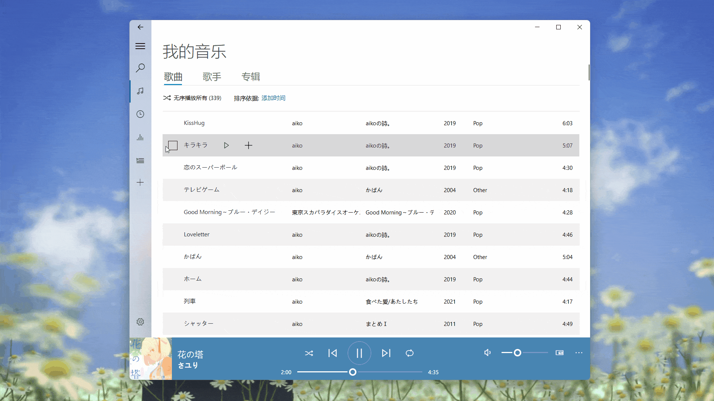
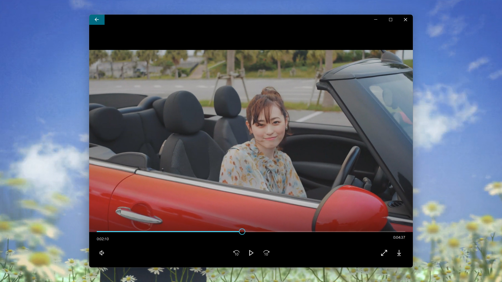

<p align="center">
  
</p>
  <h1 align="center">
  Groove Music
</h1>
<p align="center">
  A cross-platform music player based on PyQt5
</p>

<p align="center">

  <a style="text-decoration:none">
    
  </a>

  <a style="text-decoration:none">
    
  </a>

  <a style="text-decoration:none">
    
  </a>
</p>

<p align="center">
English | <a href="docs/README_zh.md">简体中文</a>
</p>


## Features

* Play local music

  

* Create and manage custom playlist

  

* View and edit song meta data

  

* Watch and download MV

  


## Quick start
1. Create virtual environment:

    ```shell
    conda create -n Groove python=3.8
    conda activate Groove
    pip install -r requirements.txt -i https://pypi.tuna.tsinghua.edu.cn/simple
    ```

2. Download decoder:
   * For the Win32, you should install [LAV Filters](https://github.com/Nevcairiel/LAVFilters/releases/download/0.74/LAVFilters-0.74-Installer.exe).
   * For the Linux, you should install GStreamer.

3. Open Groove music:

    ```shell
    cd app
    conda activate Groove
    python Groove.py
    ```


## Document
Want to know more about Groove Music? Please read the [help document](https://groove-music.readthedocs.io) 👈

## See also

- [zhiyiYo/PyQt-Frameless-Window](https://github.com/zhiyiYo/PyQt-Frameless-Window)：A cross-platform frameless window based on pyqt5, support Win32, Linux and macOS.
- [zhiyiYo/PyQt-Fluent-Widgets](https://github.com/zhiyiYo/PyQt-Fluent-Widgets)：A fluent design widgets library based on PyQt5
- [jsmolka/egg-player](https://github.com/jsmolka/egg-player)：A Groove Music like music player. The code of this repo is very elegant.

## License
Groove is licensed under GPLv3 for non-commercial usage.

Copyright © 2020 by zhiyiYo.

> *Attention*
>
> This software is only for learning and communication, the songs' and playlists' copyright belongs to each music platform.