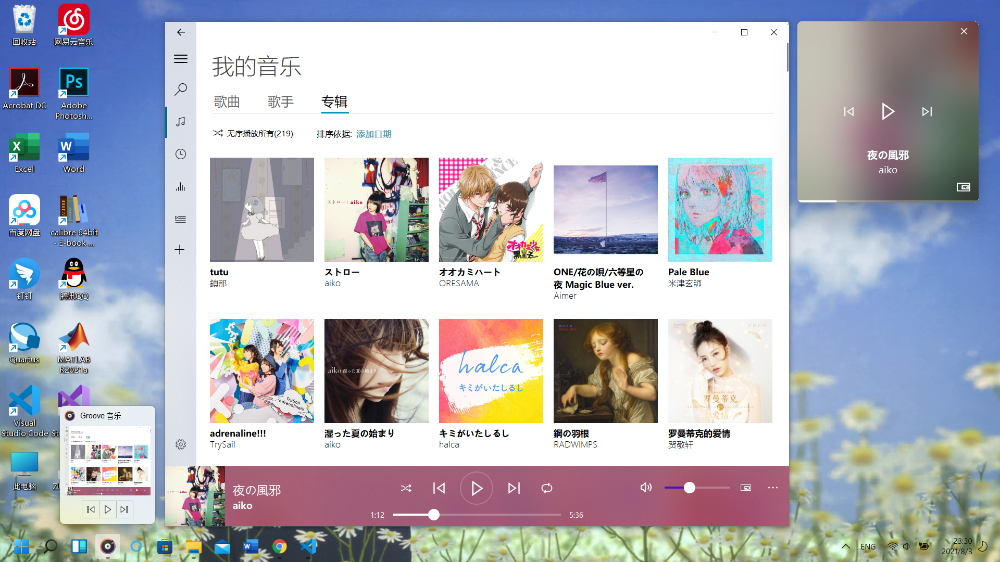
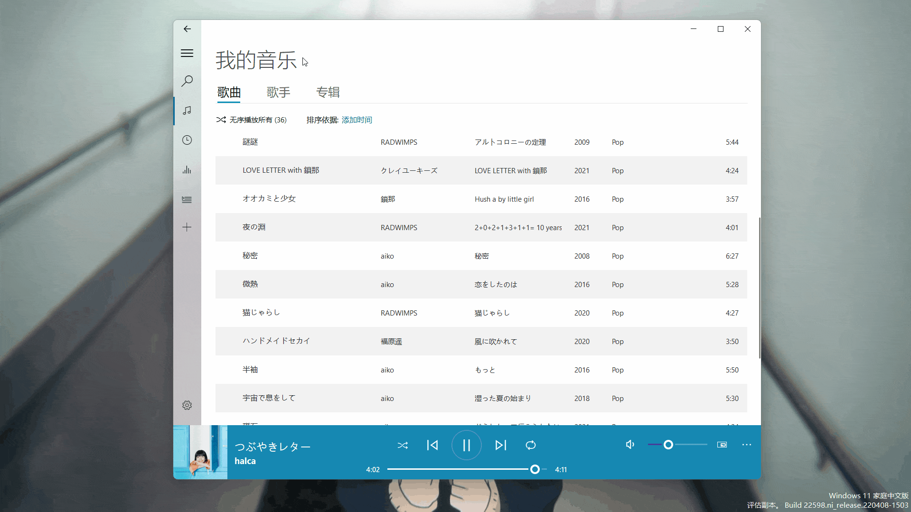
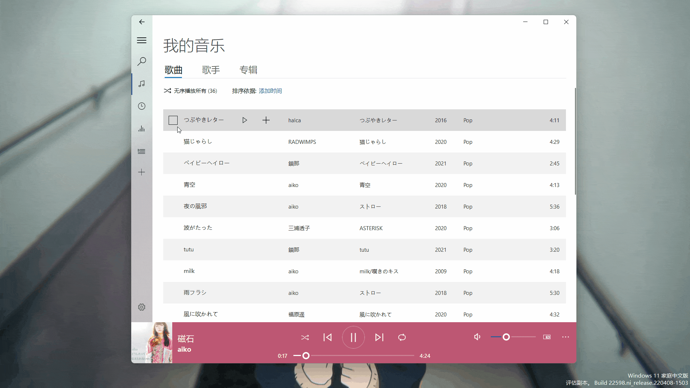
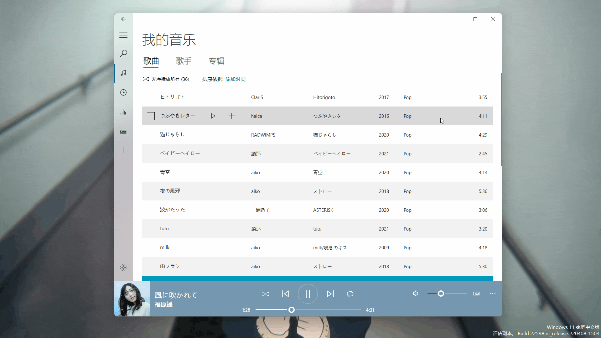

<p align="center">
  
</p>
  <h1 align="center">
  Groove Music
</h1>
<p align="center">
  A cross-platform music player based on PyQt5.
</p>

<p align="center">

  <a style="text-decoration:none">
    
  </a>

  <a style="text-decoration:none">
    
  </a>

  <a style="text-decoration:none">
    
  </a>
</p>

<p align="center">
English | <a href="docs/README_zh.md">简体中文</a>
</p>

## Interface


## Features

* Play local music

  

* Search, play and download online music

  

* Create and manage custom playlist

  

* View and edit song meta data

  

* Watch and download MV

  


## Quick start
1. Create virtual environment:

    ```shell
    conda create -n Groove python=3.8
    conda activate Groove
    pip install -r requirements.txt -i https://pypi.tuna.tsinghua.edu.cn/simple
    ```

2. Download decoder:
   * For the Win32 platform, you should install [LAV Filters](https://github.com/Nevcairiel/LAVFilters/releases/download/0.74/LAVFilters-0.74-Installer.exe).
   * For the Unix platform, you should install GStreamer.

3. Open Groove music:

    ```shell
    cd app
    conda activate Groove
    python Groove.py
    ```

## Install
### Win32
1. Download and install [LAV Filters](https://github.com/Nevcairiel/LAVFilters/releases/download/0.74/LAVFilters-0.74-Installer.exe)
2. Download `Groove_v*.*.*_windows_x64.zip` from [release page](https://github.com/zhiyiYo/Groove/releases)
3. Unzip `Groove_v*.*.*_windows_x64.zip`
4. Go to `Groove` folder, find and double click **Groove.exe**
5. Start to enjoy your music~~

### Linux
1. Install GStreamer
2. Download `Groove_v*.*.*_linux_x64.zip` from [release page](https://github.com/zhiyiYo/Groove/releases)
3. Unzip `Groove_v*.*.*_linux_x64.zip`
4. Go to `Groove` folder, find and double click the **Groove** executable file
5. Start to enjoy your music~~


## FAQ
* **Why does the window get stuck when it is dragged?**

  Because the interface background uses acrylic effect, this problem will occur for some versions of win10. There are three solutions:

  * Upgrade Win10 to Win11.
  * Uncheck the check box of **Advanced system settings --> Performance --> Show window contents when dragging**.
  * Turn off the option to enable acrylic background in the setting interface.

* **What formats of audio files are supported?**

  Currently, the following formats are supported:
  * MP3
  * AAC
  * AC3
  * APE
  * AIFF
  * FLAC
  * TTA
  * OGG
  * OPUS
  * MP4/M4A

* **Why did GStreamer report this error: Warning: "No decoder available for type blah blah"?**

  I solved this problem on Ubuntu 20.04 by `sudo apt-get install gstreamer1.0-libav`.

## License
```
MIT License

Copyright (c) 2022 Zhengzhi Huang

Permission is hereby granted, free of charge, to any person obtaining a copy
of this software and associated documentation files (the "Software"), to deal
in the Software without restriction, including without limitation the rights
to use, copy, modify, merge, publish, distribute, sublicense, and/or sell
copies of the Software, and to permit persons to whom the Software is
furnished to do so, subject to the following conditions:

The above copyright notice and this permission notice shall be included in all
copies or substantial portions of the Software.

THE SOFTWARE IS PROVIDED "AS IS", WITHOUT WARRANTY OF ANY KIND, EXPRESS OR
IMPLIED, INCLUDING BUT NOT LIMITED TO THE WARRANTIES OF MERCHANTABILITY,
FITNESS FOR A PARTICULAR PURPOSE AND NONINFRINGEMENT. IN NO EVENT SHALL THE
AUTHORS OR COPYRIGHT HOLDERS BE LIABLE FOR ANY CLAIM, DAMAGES OR OTHER
LIABILITY, WHETHER IN AN ACTION OF CONTRACT, TORT OR OTHERWISE, ARISING FROM,
OUT OF OR IN CONNECTION WITH THE SOFTWARE OR THE USE OR OTHER DEALINGS IN THE
SOFTWARE.
```