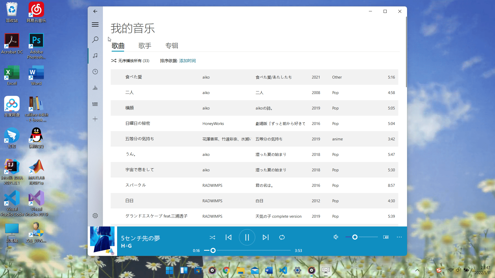

<p align="center">
  
</p>
  <h1 align="center">
  Groove Music
</h1>
<p align="center">
  A music player based on PyQt5 and LAV Filters.
</p>

<p align="center">

  <a style="text-decoration:none">
    
  </a>

  <a style="text-decoration:none">
    
  </a>

  <a style="text-decoration:none">
    
  </a>

  <a style="text-decoration:none">
    
  </a>
</p>

## Interface


## Features

* Play local music


* Search, play and download online music


* Create playlist


* View and edit information


* Automatically retrieve and update missing metadata


## Quick start
1. Create virtual environment:

    ```shell
    conda create -n Groove python=3.8
    conda activate Groove
    pip install -r requirements.txt -i https://pypi.tuna.tsinghua.edu.cn/simple
    ```

2. Download [LAV Filters](https://github.com/Nevcairiel/LAVFilters/releases).
3. Open Groove music:

    ```shell
    cd app
    conda activate Groove
    python Groove.py
    ```


## FAQ
* **Why does the window get stuck when it is dragged?**

  Because the interface background uses acrylic effect, this problem will occur for some versions of win10. There are three solutions:

  * Upgrade win10 to the latest version.
  * Uncheck the check box of **Advanced system settings --> Performance --> Show window contents when dragging**.
  * Turn off the option to enable acrylic background in the setting interface.

* **What formats of audio files are supported?**

  Currently, the following audio files are supported:
  * mp3
  * flac
  * mp4/m4a
