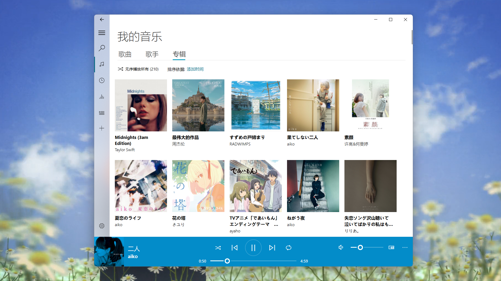
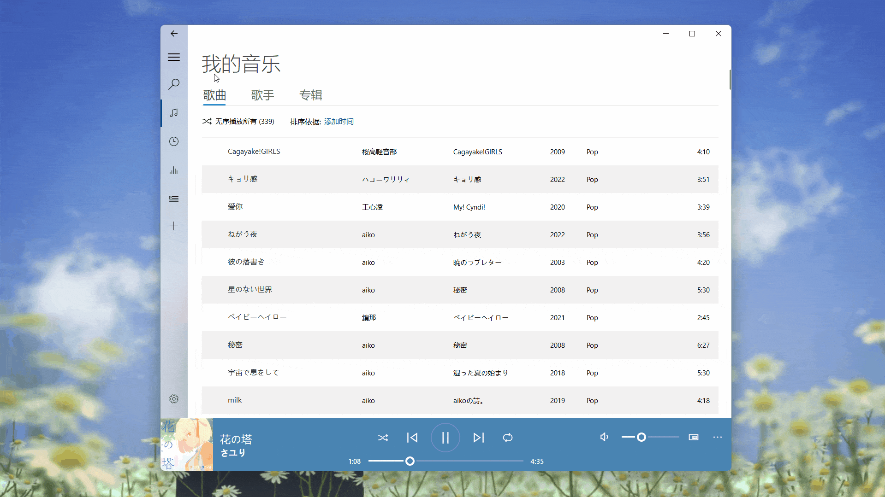
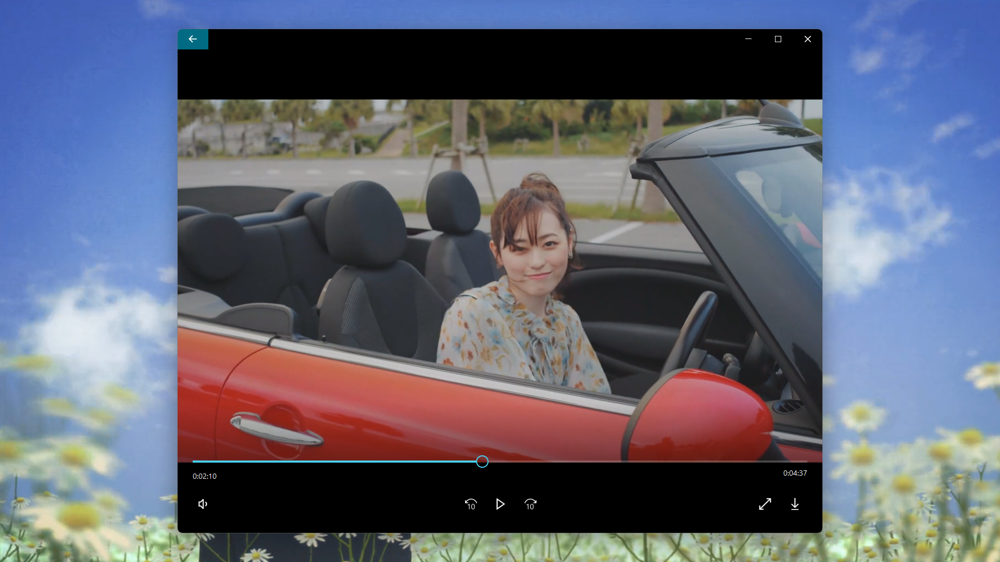

<p align="center">
  
</p>
  <h1 align="center">
  Groove 音乐
</h1>
<p align="center">
  一个基于 PyQt5 的跨平台音乐播放器
</p>

<p align="center">

  <a style="text-decoration:none">
    
  </a>

  <a style="text-decoration:none">
    
  </a>

  <a style="text-decoration:none">
    
  </a>
</p>

<p align="center">
<a href="../README.md">English</a> | 简体中文
</p>

## 界面


## 功能

* 播放本地音乐

  

* 搜索、播放和下载在线音乐

  

* 创建和管理个人播放列表

  

* 查看和编辑歌曲元数据

  

* 观看和下载在线 MV

  


## 快速开始
1. 创建虚拟环境:

    ```shell
    conda create -n Groove python=3.8
    conda activate Groove
    pip install -r requirements.txt -i https://pypi.tuna.tsinghua.edu.cn/simple
    ```

2. 下载解码器：
   * 对于 Win32，安装 [LAV Filters](https://github.com/Nevcairiel/LAVFilters/releases/download/0.74/LAVFilters-0.74-Installer.exe)
   * 对于 Linux，安装 GStreamer


3. 打开 Groove 音乐:

    ```shell
    cd app
    conda activate Groove
    python Groove.py
    ```

## 安装
### Win32
#### 安装包
1. 下载并安装 [LAV Filters](https://github.com/Nevcairiel/LAVFilters/releases/download/0.74/LAVFilters-0.74-Installer.exe)
2. 从 [Release](https://github.com/zhiyiYo/Groove/releases) 页面下载 `Groove_v*.*.*_x64_setup.exe`
3. 右键并以管理员身份运行 `Groove_v*.*.*_x64_setup.exe`，根据安装向导完成 Groove 的安装
4. 开启你的音乐之旅 😊~~

#### 免安装版
1. 下载并安装 [LAV Filters](https://github.com/Nevcairiel/LAVFilters/releases/download/0.74/LAVFilters-0.74-Installer.exe)
2. 从 [Release](https://github.com/zhiyiYo/Groove/releases) 页面下载 `Groove_v*.*.*_windows_x64.zip`
3. 解压 `Groove_v*.*.*_windows_x64.zip`
4. 在解压出来的 `Groove` 文件夹中，找到并双击运行 **Groove.exe**
5. 开启你的音乐之旅 😊~~

### Linux
1. 安装 GStreamer
2. 从 [Release](https://github.com/zhiyiYo/Groove/releases) 页面下载 `Groove_v*.*.*_linux_x64.zip`
3. 解压 `Groove_v*.*.*_linux_x64.zip`
4. 在解压出来的 `Groove` 文件夹中，找到并双击运行 **Groove** 可执行文件
5. 开启你的音乐之旅 😊~~


## 文档
使用 Groove 音乐之前建议阅读[帮助文档](https://groove-music.readthedocs.io)，你想知道的，都在这里~~
